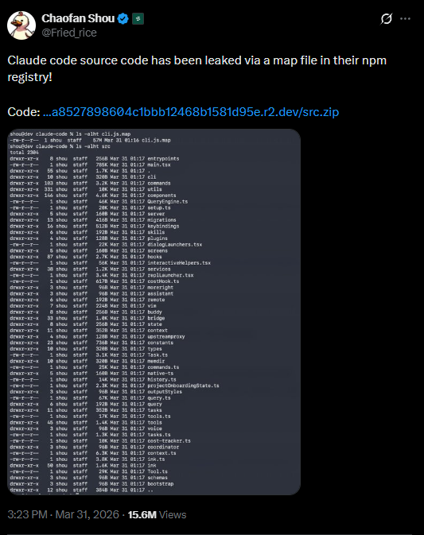

# Claude Code CLI — Leaked Source Archive

> **This repository contains raw, unmodified source code from a publicly exposed build artifact of Anthropic's Claude Code CLI. It is provided strictly as-is for archival, educational, and security research purposes. This is NOT an official Anthropic repository.**

---

## Warnings

- **Do not build, run, or deploy this code.** The build toolchain (Bun bundler, path aliases, `bun:bundle` feature gates, `--define` flags) is absent. The source will not compile.
- **Do not use this code in production.** It contains references to Anthropic's internal services, analytics endpoints, OAuth client IDs, staging URLs, and infrastructure that are non-functional outside their environment.
- **No license is granted** for any proprietary material. Public exposure does not create open-source rights. See [License](#license).
- **This repository is not affiliated with Anthropic.** It exists solely as a neutral archive of publicly discussed material.
- **Do not extract secrets.** No hardcoded API keys or usable credentials are present in the source. OAuth client IDs are public-facing identifiers, not secrets.
- **Internal codenames are present.** The source contains Anthropic's internal project codenames (Tengu, Capybara, Fennec, Numbat, Kairos, Lodestone, etc.) and internal Slack channel references. These are documented contextually, not redacted.

---

## Do's and Don'ts

<details>
<summary><strong>Do</strong></summary>

- Read the source to understand how a large-scale agentic CLI is architected
- Study the permission model, sandbox system, and tool execution patterns
- Reference the system prompt engineering in `constants/prompts.ts` for research
- Examine the hook system, MCP integration, and session management patterns
- Use it as a reference for understanding Claude Code's behavior when building integrations
- Report security issues found to Anthropic's responsible disclosure program

</details>

<details>
<summary><strong>Don't</strong></summary>

- Attempt to reconstruct the build system or create a runnable fork
- Redistribute modified versions claiming compatibility with Anthropic's services
- Extract OAuth configurations to attempt unauthorized API access
- Use the system prompts to circumvent Claude's safety guidelines
- Scrape internal URLs, staging endpoints, or analytics identifiers for any purpose
- Treat any observed behavior as a stable API contract — this is a snapshot, not documentation

</details>

---

## Origin

On March 31st, 2026, security researcher **[Chaofan Shou](https://x.com/Fried_rice)** discovered that Anthropic had accidentally shipped a sourcemap file (`cli.js.map`, ~67 MB) inside the published `@anthropic-ai/claude-code` npm package. The sourcemap contained a complete mapping back to the original TypeScript source tree, allowing full reconstruction of the pre-bundle application code — **1,902 files, ~29 MB** of raw TypeScript/TSX.

<p align="center">
  
</p>

**Original disclosure:** [x.com/Fried_rice/status/2038894956459290963](https://x.com/Fried_rice/status/2038894956459290963) (15.3M views, 28K likes)
**Original download:** [t.co/jBiMoOzt8G](https://t.co/jBiMoOzt8G)

### How It Happened

npm packages are published as tarballs. Anthropic's build pipeline used the Bun bundler to compile TypeScript source into a single `cli.js` output. Bun, like most modern bundlers, generates a companion `.map` file (a [source map](https://developer.chrome.com/docs/devtools/javascript/source-maps)) that maps every line of the minified output back to the original source file, line, and column. This file is intended for internal debugging and is normally excluded from published artifacts via `.npmignore` or the `files` field in `package.json`.

In this case, `cli.js.map` was included in the published tarball. The sourcemap's `sourcesContent` array contained the verbatim text of every source file referenced during bundling — the entire application, including internal-only code paths, system prompts, OAuth configurations, feature flags, analytics identifiers, and infrastructure references. Extracting the source required only parsing the JSON map file and writing each entry to disk.

The exposure was not a hack, exploit, or unauthorized access. npm packages are public artifacts; their contents are downloadable by anyone via `npm pack` or direct tarball URL. The source was unprotected by design oversight, not by security bypass.

Anthropic has since removed the sourcemap from subsequent npm releases.

---

## What This Is

A snapshot of the TypeScript source behind `claude` — Anthropic's agentic coding CLI (marketed as "Claude Code"). The code was recovered from the sourcemap described above. The `src/src/` tree is the full application source: **1,902 files, ~29 MB of TypeScript/TSX**.

This snapshot captures the CLI at a point where the latest model family is Claude 4.5/4.6, with Opus 4.6 as the frontier model. The default model for Max/Team Premium subscribers is Opus 4.6; all others default to Sonnet 4.6.

---

## Source Overview (`src/src/`)

### Stack

| Layer | Technology |
|---|---|
| Language | TypeScript / TSX |
| Runtime | Node.js ≥18 / Bun |
| Bundler | Bun (`bun:bundle` with `feature()` dead-code elimination) |
| UI framework | React + [Ink](https://github.com/vadimdemedes/ink) (terminal UI) |
| API SDK | `@anthropic-ai/sdk` |
| CLI framework | `@commander-js/extra-typings` |
| MCP SDK | `@modelcontextprotocol/sdk` |
| State management | Zustand-style store (`state/AppStateStore.ts`) |
| Schema validation | Zod v4 |
| Utilities | `lodash-es`, `chalk`, `glob`, `semver` |
| Sandbox runtime | `@anthropic-ai/sandbox-runtime` (bubblewrap on Linux, seatbelt on macOS) |
| Telemetry | OpenTelemetry (OTel), Statsig, GrowthBook |
| Session storage | JSONL transcript files |

### Codebase Metrics

| Metric | Value |
|---|---|
| Total files | 1,902 |
| Total size | ~29 MB |
| Largest file | `screens/REPL.tsx` ~875 KB |
| Tool directories | 42 |
| Command directories | 86 + 15 standalone files |
| React hooks | 83 files |
| Utility files | 298 files + 31 subdirectories |
| UI components | 113 files + 31 subdirectories |
| Migrations | 11 sequential data migrations |

<details>
<summary><strong>Largest Files (by size)</strong></summary>

| File | Size | What it does |
|---|---|---|
| `screens/REPL.tsx` | ~875 KB | Main interactive screen — message list, prompt, tool dialogs, status, voice, MCP, IDE integration |
| `main.tsx` | ~785 KB | Primary entry point — argv parsing, migrations, telemetry bootstrap, mode routing |
| `components/ScrollKeybindingHandler.tsx` | ~347 KB | Keyboard-driven scroll with vim bindings |
| `utils/hooks.ts` | ~314 KB | Hook system — 25 hook event types, shell/HTTP/prompt/agent execution |
| `hooks/useTypeahead.tsx` | ~265 KB | Autocomplete/typeahead with fuzzy matching |
| `cli/print.ts` | ~246 KB | Headless/non-interactive mode (`claude -p "prompt"`) |
| `components/Spinner.tsx` | ~228 KB | Animated activity indicator variants |
| `hooks/useReplBridge.tsx` | ~210 KB | claude.ai remote session bridge |
| `utils/sessionStorage.ts` | ~208 KB | JSONL transcript persistence (~5,100 lines) |
| `utils/messages.ts` | ~196 KB | Message normalization, serialization, creation |

</details>

---

## Entry Points

| File | How it's invoked | Purpose |
|---|---|---|
| `main.tsx` | `claude` (default) | Parses CLI args, runs migrations, routes to REPL or headless mode |
| `entrypoints/cli.tsx` | Interactive mode | Renders the terminal UI shell |
| `entrypoints/init.ts` | First-run | Trust dialog, telemetry opt-in, initial setup |
| `entrypoints/mcp.ts` | `claude mcp serve` | Runs as an MCP server |
| `entrypoints/sdk/` | Programmatic | SDK entry for embedding Claude Code in other tools |
| `cli/print.ts` | `claude -p "..."` | Headless single-prompt execution |

---

## Core Architecture

### Query Lifecycle

```
User Input → QueryEngine.processInput()
  → query.ts (query loop)
    → API call (streaming, with retries + exponential backoff)
    → Tool execution (permission check → validate → execute → render)
    → Auto-compaction (if context window pressure)
    → Response rendering
  → Session transcript write (JSONL)
```

| File | Role |
|---|---|
| `QueryEngine.ts` | Per-conversation lifecycle owner. Drives both SDK and REPL paths. |
| `query.ts` (~69 KB) | The query loop — API calls, tool orchestration, compaction, streaming, retries, recovery. |
| `Tool.ts` | Base `Tool<Input, Output, Progress>` interface. All tools implement this contract. |
| `tools.ts` | Tool registry — assembles the pool from builtins, MCP, LSP, and plugins. |
| `commands.ts` | Slash-command registry (`/help`, `/compact`, `/model`, `/resume`, etc.). |
| `setup.ts` | Per-session environment — cwd, hooks, worktree, permissions, telemetry beacon. |
| `bootstrap/state.ts` (~56 KB) | Global singleton state — session ID, model usage, telemetry counters, cost tracking, feature latches. |

<details>
<summary><strong>Permission System</strong></summary>

The CLI enforces a layered permission model that controls tool execution:

| Mode | Behavior |
|---|---|
| `default` | Prompts user for each tool invocation not matching an allow rule |
| `plan` | Read-only — blocks all write/execute tools; forces Opus upgrade for reasoning |
| `acceptEdits` | Auto-approves file edits; still prompts for shell commands |
| `bypassPermissions` | Skips all permission checks (requires explicit opt-in) |
| `dontAsk` | Never prompts; denies anything not pre-allowed |
| `auto` | (Internal/ant-only) Automatic permission decisions via classifier |

Permission rules are defined in settings as `allow`/`deny` arrays with patterns like `Edit(path/to/file)`, `Bash(npm test)`, or `WebFetch(domain:example.com)`.

</details>

<details>
<summary><strong>Settings System (5-Layer Cascade)</strong></summary>

Settings resolve in priority order (later overrides earlier):

| Priority | Source | Location | Scope |
|---|---|---|---|
| 1 (lowest) | `userSettings` | `~/.claude/settings.json` | Global, all projects |
| 2 | `projectSettings` | `.claude/settings.json` | Shared, committed to git |
| 3 | `localSettings` | `.claude/settings.local.json` | Per-machine, gitignored |
| 4 | `flagSettings` | `--settings` CLI flag | Per-invocation |
| 5 (highest) | `policySettings` | `managed-settings.json` or remote API | Enterprise/MDM-managed |

Schema URL: `https://json.schemastore.org/claude-code-settings.json`

</details>

<details>
<summary><strong>Context Management (Compaction)</strong></summary>

The CLI manages context window pressure through multiple compaction strategies:

| Strategy | File | Trigger |
|---|---|---|
| Auto-compact | `services/compact/autoCompact.ts` | Context exceeds threshold |
| Reactive compact | `services/compact/compact.ts` (~60 KB) | Real-time context pressure |
| Micro-compact | `services/compact/microCompact.ts` | Cached function result clearing |
| Session memory | `services/compact/sessionMemoryCompact.ts` | Cross-turn memory preservation |
| Context collapse | Feature-gated (`CONTEXT_COLLAPSE`) | Structural context reduction |
| History snip | Feature-gated (`HISTORY_SNIP`) | Older message truncation |

The system prompt includes a `SYSTEM_PROMPT_DYNAMIC_BOUNDARY` marker that splits content into a static (globally cacheable) prefix and dynamic (session-specific) suffix, optimizing prompt cache hit rates.

</details>

<details>
<summary><strong>Sandbox System</strong></summary>

Sandboxed command execution via `@anthropic-ai/sandbox-runtime`:

- **macOS**: Seatbelt (App Sandbox)
- **Linux**: bubblewrap (`bwrap`)
- **WSL2**: bubblewrap (WSL1 is unsupported)
- **Windows native**: Not supported

The sandbox enforces filesystem isolation (deny-write to settings, deny-read to sensitive paths), network restrictions (domain allowlists), and bare-git-repo attack prevention (scrubs planted `HEAD`/`objects`/`refs` files to prevent `core.fsmonitor` escapes).

</details>

<details>
<summary><strong>Session Persistence</strong></summary>

Sessions are persisted as JSONL files at `~/.claude/projects/<sanitized-cwd>/<session-id>.jsonl`. Each line is a typed entry (user message, assistant message, tool result, metadata, compaction boundary, etc.). The system supports:

- **Resume** (`claude --resume`, `/resume`) — restores conversation from transcript
- **Session branching** — fork a session at any point
- **Teleportation** (`/teleport`) — serialize session state to a git branch for cross-machine resume
- **Remote sync** — bidirectional sync with claude.ai web sessions via WebSocket bridge
- **Session naming** (`/rename`) — custom titles with tail-window re-append to survive compaction

</details>

<details>
<summary><strong>Cost Tracking</strong></summary>

Real-time token usage and cost tracking with per-model granularity:

| Model | Input (per Mtok) | Output (per Mtok) |
|---|---|---|
| Haiku 3.5 | $0.80 | $4.00 |
| Haiku 4.5 | $1.00 | $5.00 |
| Sonnet 3.5–4.6 | $3.00 | $15.00 |
| Opus 4.5–4.6 | $5.00 | $25.00 |
| Opus 4.6 (fast mode) | $30.00 | $150.00 |
| Opus 4.0–4.1 (legacy) | $15.00 | $75.00 |

Web search: $0.01 per request. Prompt cache reads are 10x cheaper than input; cache writes are 1.25x input cost.

</details>

---

## Tools (`tools/`)

42 tool directories. Each contains an implementation, prompt template, constants, and optional UI components.

<details>
<summary><strong>File Operations</strong></summary>

| Tool | Purpose |
|---|---|
| `FileReadTool` | Read file contents with line ranges |
| `FileWriteTool` | Create or overwrite files |
| `FileEditTool` | Surgical line-level edits |
| `GlobTool` | Find files by pattern |
| `GrepTool` | Search file contents (ripgrep) |
| `NotebookEditTool` | Jupyter notebook manipulation |

</details>

<details>
<summary><strong>Execution</strong></summary>

| Tool | Purpose |
|---|---|
| `BashTool` | Shell command execution (sandboxable) |
| `PowerShellTool` | Windows PowerShell execution |
| `REPLTool` | Persistent REPL sessions (Python, Node, etc.) |

</details>

<details>
<summary><strong>Agent / Orchestration</strong></summary>

| Tool | Purpose |
|---|---|
| `AgentTool` | Spawn subagents (fork, explore, verify) — runs in background, inherits tools |
| `TaskCreateTool` | Create background tasks |
| `TaskGetTool` / `TaskListTool` / `TaskUpdateTool` / `TaskStopTool` / `TaskOutputTool` | Task lifecycle management |
| `TodoWriteTool` | In-session task tracking |
| `SendMessageTool` | Inter-agent messaging |
| `TeamCreateTool` / `TeamDeleteTool` | Multi-agent team management |

</details>

<details>
<summary><strong>MCP Integration</strong></summary>

| Tool | Purpose |
|---|---|
| `MCPTool` | Execute tools from connected MCP servers |
| `McpAuthTool` | MCP OAuth authentication |
| `ListMcpResourcesTool` / `ReadMcpResourceTool` | MCP resource browsing |

</details>

<details>
<summary><strong>Search, Web, Session, Config, Planning, and Other Tools</strong></summary>

**Search & Web**

| Tool | Purpose |
|---|---|
| `WebSearchTool` | Server-side web search |
| `WebFetchTool` | Fetch URL content with domain restrictions |
| `ToolSearchTool` | Search available tools |

**Session & Config**

| Tool | Purpose |
|---|---|
| `ConfigTool` | Read/modify settings |
| `SkillTool` | Execute user-defined skills |
| `SleepTool` | Autonomous mode — sleep between ticks |
| `ScheduleCronTool` | Schedule recurring tasks |
| `RemoteTriggerTool` | Trigger remote workflows |

**Planning & Workflow**

| Tool | Purpose |
|---|---|
| `EnterPlanModeTool` / `ExitPlanModeTool` | Toggle plan mode (read-only) |
| `EnterWorktreeTool` / `ExitWorktreeTool` | Git worktree isolation |
| `BriefTool` | Kairos assistant mode briefings |

**Other**

| Tool | Purpose |
|---|---|
| `AskUserQuestionTool` | Explicit user clarification |
| `SyntheticOutputTool` | Structured JSON output |
| `LSPTool` | Language Server Protocol queries |
| `DiscoverSkillsTool` | Skill search (experimental) |

</details>

---

## Commands (`commands/`)

86 command directories + 15 standalone files. Each `/slash` command maps to a command handler.

<details>
<summary><strong>Notable Subsystems</strong></summary>

| Command | What it does |
|---|---|
| `mcp/` | `mcp add`, `mcp serve`, MCP server lifecycle |
| `plugin/` | Plugin install/remove/reload |
| `teleport/` | Session teleportation across machines |
| `tasks/` | Background task management |
| `review/` | Code review workflows |
| `doctor/` | Diagnostic health checks (`/doctor`) |
| `install.tsx` (~39 KB) | IDE extension and shell integration installer |
| `insights.ts` (~116 KB) | Usage analytics dashboard |
| `ultraplan.tsx` (~67 KB) | Multi-step planning with verification agents |
| `sandbox.tsx` | Sandbox configuration and diagnostics |
| `clear.tsx` | Session clear with cost summary |
| `compact.ts` | Manual context compaction |
| `resume.tsx` | Session resume UI with selection |
| `model.tsx` | Model switcher with pricing display |
| `config.tsx` | Interactive settings editor |

</details>

---

## Services (`services/`)

<details>
<summary><strong>API Layer (<code>services/api/</code>)</strong></summary>

| File | Purpose | Size |
|---|---|---|
| `claude.ts` | Core API client — system prompt assembly, request building, streaming, anthropic-beta headers | ~126 KB |
| `errors.ts` | Error categorization — overloaded, rate-limited, invalid request, credit exhaustion | ~42 KB |
| `withRetry.ts` | Retry logic — exponential backoff with jitter, abort signal handling | ~28 KB |
| `promptCacheBreakDetection.ts` | Detects cache breaks from system prompt changes | ~26 KB |
| `logging.ts` | API request/response logging | ~24 KB |
| `filesApi.ts` | File upload API | ~21 KB |
| `sessionIngress.ts` | Session transcript upload to Anthropic servers | ~17 KB |
| `client.ts` | HTTP client configuration (proxies, certificates, timeouts) | ~16 KB |

</details>

<details>
<summary><strong>Compaction, Analytics, MCP, and Other Services</strong></summary>

**Compaction (`services/compact/`)**

11 files totaling ~145 KB. Implements the multi-strategy context management system described above.

**Analytics & Feature Flags (`services/analytics/`)**

Statsig for event logging, GrowthBook for feature flags. Feature values are cached with staleness tracking (`getFeatureValue_CACHED_MAY_BE_STALE`). All GrowthBook flags follow the `tengu_*` naming convention.

**MCP (`services/mcp/`)**

Full MCP client implementation — server config parsing, tool/resource discovery, server lifecycle management, instruction injection.

**Other Services**

| Directory | Purpose |
|---|---|
| `oauth/` | OAuth token management |
| `lsp/` | LSP server manager for IDE integration |
| `voice.ts` | Voice input (speech-to-text streaming) |
| `tips/` | Contextual tip registry |
| `policyLimits/` | Enterprise policy enforcement |
| `remoteManagedSettings/` | MDM/remote settings sync |
| `plugins/` | Plugin validation and CLI |
| `skillSearch/` | Experimental skill discovery |

</details>

---

## Hook System (`utils/hooks.ts`)

<details>
<summary><strong>25 Hook Event Types</strong></summary>

**Tool lifecycle:** `PreToolUse`, `PostToolUse`, `PostToolUseFailure`, `PermissionDenied`, `PermissionRequest`
**Session lifecycle:** `SessionStart`, `SessionEnd`, `Setup`, `Stop`, `StopFailure`
**Agent lifecycle:** `SubagentStart`, `SubagentStop`, `TeammateIdle`
**Task lifecycle:** `TaskCreated`, `TaskCompleted`
**Content events:** `UserPromptSubmit`, `Notification`, `PreCompact`, `PostCompact`, `ConfigChange`, `CwdChanged`, `FileChanged`, `InstructionsLoaded`
**Interactive:** `Elicitation`, `ElicitationResult`
**UI:** `StatusLine`, `FileSuggestion`

</details>

<details>
<summary><strong>How Hooks Work</strong></summary>

Hooks receive a JSON payload via stdin with session ID, transcript path, cwd, permission mode, and event-specific data. They return structured JSON to influence behavior (approve/deny permissions, inject context, stop execution, modify tool input).

Hook types: `command` (shell), `http` (webhook), `prompt` (LLM-evaluated), `agent` (subagent-evaluated).

Security: All hooks require workspace trust. SessionEnd hooks have a 1.5s timeout (configurable via `CLAUDE_CODE_SESSIONEND_HOOKS_TIMEOUT_MS`).

</details>

---

## Bridge System (`bridge/`)

<details>
<summary><strong>31 files, ~500 KB — REPL ↔ claude.ai bidirectional sync</strong></summary>

| File | Purpose |
|---|---|
| `bridgeMain.ts` (~116 KB) | Core bridge logic |
| `replBridge.ts` (~100 KB) | REPL-side bridge integration |
| `remoteBridgeCore.ts` (~39 KB) | Remote connection management |
| `initReplBridge.ts` (~24 KB) | Bridge initialization |
| `bridgeApi.ts` (~18 KB) | Bridge HTTP API |
| `bridgeUI.ts` (~17 KB) | Bridge UI components |
| `replBridgeTransport.ts` (~16 KB) | WebSocket transport layer |
| `jwtUtils.ts` (~9 KB) | JWT token handling |
| `trustedDevice.ts` (~8 KB) | Device trust management |

The bridge supports: remote message injection, permission delegation, session pointer management, capacity wake signaling, and JWT-based authentication.

</details>

---

## Model System

<details>
<summary><strong>Supported Models (at time of snapshot)</strong></summary>

| Family | Models | Default context | 1M context available |
|---|---|---|---|
| Claude 4.6 | Opus 4.6, Sonnet 4.6 | 200K | Yes (Max/Team Premium) |
| Claude 4.5 | Opus 4.5, Sonnet 4.5 | 200K | Yes |
| Claude 4.0/4.1 | Opus 4, Opus 4.1, Sonnet 4 | 200K | Yes |
| Claude 3.x | Sonnet 3.7, Sonnet 3.5, Haiku 3.5 | 200K | No |
| Claude 4.5 | Haiku 4.5 | 200K | No |

</details>

<details>
<summary><strong>Model Selection, Aliases, Remapping, and Providers</strong></summary>

**Model Selection Priority**

1. `/model` command (session override) — highest
2. `--model` CLI flag
3. `ANTHROPIC_MODEL` environment variable
4. User settings (`model` field)
5. Built-in default (Opus 4.6 for Max/Team Premium, Sonnet 4.6 for all others)

**Model Aliases**

Users can specify aliases instead of full model IDs: `opus`, `sonnet`, `haiku`, `best`, `opusplan` (Opus in plan mode, Sonnet otherwise). The `[1m]` suffix enables 1M context on supported models.

**Legacy Model Remapping**

Opus 4.0 and 4.1 are automatically remapped to the current Opus default on the first-party API. This is opt-out via `CLAUDE_CODE_DISABLE_LEGACY_MODEL_REMAP`.

**API Providers**

| Provider | Config |
|---|---|
| First-party (Anthropic) | Default; uses `api.anthropic.com` |
| AWS Bedrock | `CLAUDE_CODE_USE_BEDROCK=1` |
| GCP Vertex AI | `CLAUDE_CODE_USE_VERTEX=1` |
| Azure Foundry | Custom deployment IDs |

</details>

---

## Authentication & OAuth

<details>
<summary><strong>Three authentication modes and OAuth configuration</strong></summary>

The CLI supports three authentication modes:

1. **API Key** — `ANTHROPIC_API_KEY` environment variable
2. **Console OAuth** — Creates an API key via Anthropic Console (scope: `org:create_api_key`)
3. **Claude.ai OAuth** — Direct inference via claude.ai subscription (scopes: `user:inference`, `user:profile`, `user:sessions:claude_code`, `user:mcp_servers`, `user:file_upload`)

OAuth config (`constants/oauth.ts`):
- Production client ID: `9d1c250a-e61b-44d9-88ed-5944d1962f5e`
- Token endpoint: `https://platform.claude.com/v1/oauth/token`
- Authorization bounces through `claude.com/cai/*` for attribution tracking
- MCP proxy: `https://mcp-proxy.anthropic.com`
- Custom OAuth URLs restricted to allowlisted FedStart/PubSec deployments only

</details>

---

## Feature Flags (Compile-Time)

The codebase uses `feature()` from `bun:bundle` for dead-code elimination at build time. In this raw source, **all branches are visible** — both internal and external code paths.

<details>
<summary><strong>All 20 observed feature flags</strong></summary>

| Flag | Subsystem |
|---|---|
| `COORDINATOR_MODE` | Multi-agent coordinator orchestration |
| `KAIROS` | Assistant/autonomous mode with tick-based wake |
| `KAIROS_BRIEF` | Brief tool for assistant mode |
| `PROACTIVE` | Proactive autonomous agent |
| `SSH_REMOTE` | SSH remote session support |
| `DIRECT_CONNECT` | Direct connection mode |
| `LODESTONE` | Deep link handling |
| `TRANSCRIPT_CLASSIFIER` | Auto-mode transcript classification |
| `UDS_INBOX` | Unix domain socket inbox |
| `COMMIT_ATTRIBUTION` | Git commit author attribution |
| `TEAMMEM` | Teammate/swarm memory |
| `CACHED_MICROCOMPACT` | Cached micro-compaction |
| `REACTIVE_COMPACT` | Reactive context compaction |
| `CONTEXT_COLLAPSE` | Structural context collapse |
| `HISTORY_SNIP` | Old message snipping |
| `BG_SESSIONS` | Background sessions |
| `EXPERIMENTAL_SKILL_SEARCH` | Skill discovery tool |
| `TEMPLATES` | Project templates |
| `VERIFICATION_AGENT` | Adversarial verification subagent |
| `TOKEN_BUDGET` | Token budget enforcement |

</details>

---

## Internal Codenames

<details>
<summary><strong>Anthropic project codenames found in source</strong></summary>

| Codename | Context |
|---|---|
| **Tengu** | The Claude Code product itself. All GrowthBook feature flags use `tengu_*` prefix. Analytics events reference `tengu_*`. |
| **Capybara** | Claude Opus 4.6 model (code comments reference "Capybara v8" for prompt tuning). `@[MODEL LAUNCH]` markers reference Capybara launch decisions. |
| **Numbat** | A future/upcoming model. Comment: "Remove this section when we launch numbat." |
| **Fennec** | An older model. Migration file `migrateFennecToOpus.ts` renames Fennec references to Opus. |
| **Kairos** | The autonomous/assistant mode feature (`feature('KAIROS')`). Enables tick-based autonomous operation with sleep/wake cycles. |
| **Lodestone** | Deep linking system (`feature('LODESTONE')`). Handles `claude://` protocol links. |
| **Hawthorn** | Tool limit configuration. `tengu_hawthorn_window` GrowthBook flag controls BashTool output limits. |

</details>

---

## Other Notable Subsystems

<details>
<summary><strong>Full directory table</strong></summary>

| Directory | Files | Purpose |
|---|---|---|
| `bridge/` | 31 | REPL bridge — bidirectional sync with claude.ai web sessions |
| `remote/` | 4 | Remote session management (WebSocket, permission bridging) |
| `coordinator/` | — | Multi-agent coordinator mode (`feature('COORDINATOR_MODE')`) |
| `buddy/` | 6 | Companion sprite/mascot system (animated terminal characters, ~46 KB `CompanionSprite.tsx`) |
| `assistant/` | 1 | Kairos assistant mode session history |
| `voice/` | — | Voice input subsystem (STT streaming) |
| `vim/` | — | Vim keybinding support |
| `keybindings/` | — | Configurable keyboard shortcuts |
| `migrations/` | 11 | Sequential data migrations (model renames, settings schema updates) |
| `skills/` | 4 + `bundled/` | Skill system (SKILL.md workflows — bundled + user-authored + MCP-provided) |
| `plugins/` | — | Plugin system (marketplace, versioned caching, install/remove lifecycle) |
| `schemas/` | — | Zod validation schemas |
| `ink/` | — | Ink framework extensions (terminal React helpers) |
| `memdir/` | — | CLAUDE.md / memory file management |
| `upstreamproxy/` | — | HTTP/HTTPS proxy support |
| `outputStyles/` | — | Configurable output formatting (verbose, concise, custom) |
| `screens/` | — | Top-level screens: REPL (~875 KB), Doctor (~73 KB), ResumeConversation (~60 KB) |
| `utils/swarm/` | — | Multi-agent swarm/teammate coordination |
| `utils/sandbox/` | 2 | Sandboxed execution adapter (bubblewrap/seatbelt + git worktree detection) |
| `utils/teleport.tsx` | 1 | Session teleportation logic (~176 KB) |

</details>

---

## System Prompt Architecture (`constants/prompts.ts`)

The system prompt (~54 KB, ~915 lines) is the core behavioral specification. It is split into:

<details>
<summary><strong>Static Sections (globally cacheable)</strong></summary>

1. **Identity** — "You are an interactive agent that helps users with software engineering tasks"
2. **Cyber risk instruction** — Safety/refusal guidelines
3. **System** — Output format, tool permissions, hooks, context summarization
4. **Doing tasks** — Code style rules, investigation before action, security awareness
5. **Executing actions with care** — Reversibility assessment, blast radius analysis, confirmation for risky operations
6. **Using your tools** — Tool preference hierarchy (dedicated tools > Bash)
7. **Tone and style** — No emojis, concise, file:line references, no colons before tool calls
8. **Output efficiency** — Brevity guidelines, lead with action not reasoning

</details>

<details>
<summary><strong>Dynamic Sections (session-specific, after <code>SYSTEM_PROMPT_DYNAMIC_BOUNDARY</code>)</strong></summary>

9. **Session guidance** — Agent tool usage, skill discovery, verification agent
10. **Memory** — CLAUDE.md content injection
11. **Environment** — Working directory, git status, platform, model info, knowledge cutoff
12. **Language** — Response language preference
13. **Output style** — Custom output format if configured
14. **MCP instructions** — Per-server tool guidance
15. **Scratchpad** — Session-specific temp directory path
16. **Function result clearing** — Micro-compaction notice

</details>

<details>
<summary><strong>Internal-Only Sections (gated on <code>USER_TYPE === 'ant'</code>)</strong></summary>

- Extended code style rules (no comments by default, verify before reporting)
- False-claims mitigation (Capybara v8-specific)
- Assertiveness counterweight (bug-spotting encouragement)
- `/issue` and `/share` internal feedback channels
- Numeric length anchors (25-word inter-tool, 100-word final response)

</details>

<details>
<summary><strong>Autonomous Mode (<code>feature('KAIROS')</code> or <code>feature('PROACTIVE')</code>)</strong></summary>

When active, replaces the standard prompt with autonomous agent instructions:
- Tick-based wake/sleep cycle via `<tick>` tags
- Terminal focus awareness (focused = collaborative, unfocused = autonomous)
- Bias toward action (read, search, edit, commit without asking)
- Sleep tool for pacing API calls (prompt cache expires after 5 minutes)

</details>

---

## Environment Variables (Observed in Source)

Documented for comprehension, not for use.

<details>
<summary><strong>Authentication</strong></summary>

| Variable | Purpose |
|---|---|
| `ANTHROPIC_API_KEY` | API key authentication |
| `CLAUDE_CODE_USE_BEDROCK` | Route through AWS Bedrock |
| `CLAUDE_CODE_USE_VERTEX` | Route through GCP Vertex AI |
| `CLAUDE_CODE_OAUTH_CLIENT_ID` | Override OAuth client ID |
| `CLAUDE_CODE_CUSTOM_OAUTH_URL` | Custom OAuth endpoint (FedStart only) |

</details>

<details>
<summary><strong>Model Configuration</strong></summary>

| Variable | Purpose |
|---|---|
| `ANTHROPIC_MODEL` | Override default model |
| `ANTHROPIC_SMALL_FAST_MODEL` | Override Haiku for lightweight tasks |
| `ANTHROPIC_DEFAULT_OPUS_MODEL` | Override default Opus model ID |
| `ANTHROPIC_DEFAULT_SONNET_MODEL` | Override default Sonnet model ID |
| `ANTHROPIC_DEFAULT_HAIKU_MODEL` | Override default Haiku model ID |
| `CLAUDE_CODE_DISABLE_LEGACY_MODEL_REMAP` | Prevent Opus 4.0/4.1 → 4.6 remap |

</details>

<details>
<summary><strong>Runtime Behavior</strong></summary>

| Variable | Purpose |
|---|---|
| `CLAUDE_CODE_ENTRYPOINT` | Tracks entry mode (`cli`, `sdk-cli`, `mcp`, `local-agent`) |
| `CLAUDE_CODE_SIMPLE` | Minimal system prompt mode |
| `CLAUDE_CODE_IS_COWORK` | Cowork session flag |
| `CLAUDE_CODE_ACTION` | GitHub Action mode |
| `CLAUDE_CODE_EXIT_AFTER_FIRST_RENDER` | Startup benchmark/test mode |
| `CLAUDE_CODE_SESSIONEND_HOOKS_TIMEOUT_MS` | SessionEnd hook timeout (default: 1500) |

</details>

<details>
<summary><strong>Build / Internal</strong></summary>

| Variable | Purpose |
|---|---|
| `USER_TYPE` | `ant` for internal Anthropic builds; controls feature availability |
| `NODE_EXTRA_CA_CERTS` | Custom CA certificates |
| `CLAUDE_CODE_CLIENT_CERT` | mTLS client certificate path |
| `USE_LOCAL_OAUTH` / `USE_STAGING_OAUTH` | Internal OAuth environment selection |

</details>

---

## What You Will NOT Find Here

- **No `package.json`, `tsconfig.json`, or lockfile.** The build system was not part of the exposed artifact.
- **No tests.** Test files are absent from this snapshot.
- **No `.env` templates.** Environment variables are documented only through code usage.
- **No CI/CD configuration.** Build and deployment pipelines are internal to Anthropic.
- **No compiled output.** This is pre-bundle TypeScript source only.
- **No git history.** This is a flat file snapshot, not a cloned repository.

---

## Data Migrations (`migrations/`)

<details>
<summary><strong>11 sequential migrations applied at startup</strong></summary>

| Migration | Purpose |
|---|---|
| `migrateFennecToOpus.ts` | Renames internal codename "Fennec" to Opus in settings |
| `migrateOpusToOpus1m.ts` | Adds `[1m]` suffix to Opus model references |
| `migrateLegacyOpusToCurrent.ts` | Remaps Opus 4.0/4.1 to current Opus |
| `migrateSonnet1mToSonnet45.ts` | Updates Sonnet 1M references to Sonnet 4.5 |
| `migrateSonnet45ToSonnet46.ts` | Updates Sonnet 4.5 to 4.6 |
| `resetProToOpusDefault.ts` | Resets Pro subscriber model default |
| `migrateAutoUpdatesToSettings.ts` | Moves auto-update config to settings |
| `migrateBypassPermissionsAcceptedToSettings.ts` | Moves bypass flag to settings |
| `migrateEnableAllProjectMcpServersToSettings.ts` | Moves MCP enablement to settings |
| `migrateReplBridgeEnabledToRemoteControlAtStartup.ts` | Renames bridge setting |
| `resetAutoModeOptInForDefaultOffer.ts` | Resets auto-mode opt-in state |

</details>

---

## License

**No open-source license applies to this repository or its contents.**

All source code in `src/src/` is the intellectual property of Anthropic, PBC. It is reproduced here without modification from a publicly exposed build artifact. Public availability does not constitute a license grant, waiver of rights, or authorization to use, modify, distribute, or create derivative works.

This repository itself (README, documentation) is provided under [CC0 1.0 Universal](https://creativecommons.org/publicdomain/zero/1.0/) — the archival commentary is public domain. The source code it describes is not.

**If you are a rights holder**, open an issue or submit a takedown request. Good-faith requests will be reviewed promptly.

---

## FAQ

<details>
<summary><strong>What is this repository?</strong></summary>

A raw, unmodified archive of TypeScript source code from Anthropic's Claude Code CLI, recovered from source maps shipped in a public npm package.

</details>

<details>
<summary><strong>Can I build or run this code?</strong></summary>

No. The Bun bundler configuration, `package.json`, `tsconfig.json`, path alias mappings, and `bun:bundle` feature flag definitions are all absent. The code will not compile without Anthropic's internal build infrastructure.

</details>

<details>
<summary><strong>Is this the complete Claude Code source?</strong></summary>

It is the application source (`src/src/`). It does not include the build system, test suite, CI/CD pipelines, compiled output, or `node_modules`. It represents a point-in-time snapshot.

</details>

<details>
<summary><strong>What runtime does Claude Code use?</strong></summary>

The code targets both Node.js (≥18) and Bun. `import { feature } from 'bun:bundle'` indicates Bun is the primary bundler. The built npm artifact runs on Node.js.

</details>

<details>
<summary><strong>What is the <code>feature()</code> function?</strong></summary>

A Bun-specific dead-code elimination gate. `feature('FLAG_NAME')` resolves to `true` or `false` at bundle time based on `--define` flags. Gated code for disabled features is stripped from the production bundle. In this raw source, all branches — internal and external — are visible.

</details>

<details>
<summary><strong>What does <code>USER_TYPE === 'ant'</code> mean?</strong></summary>

`ant` = Anthropic internal. Many code paths are split between internal builds (with access to internal Slack, analytics, staging, and infrastructure) and external/public builds. The raw source contains both. In external builds, Bun's dead-code elimination removes all `ant`-only branches.

</details>

<details>
<summary><strong>What is the REPL bridge?</strong></summary>

A bidirectional WebSocket sync system (`bridge/`, 31 files, ~500 KB) that connects the local CLI to claude.ai's web interface. It enables remote session viewing, message injection, permission delegation, and session pointer management.

</details>

<details>
<summary><strong>What is MCP?</strong></summary>

[Model Context Protocol](https://modelcontextprotocol.io/) — an open standard for connecting AI models to external tools and data sources. Claude Code acts as both an MCP client (consuming tools from external MCP servers) and an MCP server (`claude mcp serve`). MCP OAuth uses [Client ID Metadata Documents](https://datatracker.ietf.org/doc/html/draft-ietf-oauth-client-id-metadata-document-00) (SEP-991).

</details>

<details>
<summary><strong>What is <code>CLAUDE.md</code>?</strong></summary>

A project memory mechanism. Claude Code reads `CLAUDE.md` files from the working directory, parent directories, and `~/.claude/` to inject persistent project-specific instructions into the system prompt. Managed via `utils/claudemd.ts` and `memdir/`.

</details>

<details>
<summary><strong>What are "skills"?</strong></summary>

User-defined workflow templates stored as `SKILL.md` files with YAML frontmatter. Invoked via `/skill-name` slash commands. The skill system supports bundled skills, user-authored skills, and MCP-provided skills. Skills can specify a `model:` override; the `[1m]` suffix is carried over from the current session if the target model supports it.

</details>

<details>
<summary><strong>What are "plugins"?</strong></summary>

Extensibility packages that provide tools, commands, hooks, and agents. Managed via `plugins/` and `services/plugins/`. Supports a marketplace model with versioned caching, validation scopes, and install/remove lifecycle.

</details>

<details>
<summary><strong>What is "teleport"?</strong></summary>

Session teleportation (`utils/teleport.tsx`, `commands/teleport/`) — the ability to move a Claude Code session between machines by serializing conversation state, pushing to a git branch, and resuming on the target machine.

</details>

<details>
<summary><strong>What is the sandbox system?</strong></summary>

OS-level command isolation via `@anthropic-ai/sandbox-runtime`. Uses Seatbelt on macOS, bubblewrap on Linux/WSL2. Enforces filesystem and network restrictions. Includes bare-git-repo attack prevention. Configurable via `sandbox.*` settings with policy override support.

</details>

<details>
<summary><strong>What is the system prompt?</strong></summary>

Defined in `constants/prompts.ts` (~54 KB). Contains identity framing, code style rules (no unnecessary abstractions, verify before reporting), action safety instructions (confirm before destructive operations), tool usage guidance, and output efficiency directives. Split into static (cacheable) and dynamic (per-session) sections.

</details>

<details>
<summary><strong>What are the internal codenames?</strong></summary>

Tengu = Claude Code product; Capybara = Opus 4.6 model; Numbat = upcoming model; Fennec = legacy model; Kairos = autonomous assistant mode; Lodestone = deep linking; Hawthorn = tool limit configuration.

</details>

<details>
<summary><strong>Does the code contain API keys or secrets?</strong></summary>

No hardcoded API keys or secrets. OAuth client IDs are public-facing identifiers (not secrets). The code uses environment variables, PKCE OAuth flows, and OS keychain/secure storage for credential management.

</details>

<details>
<summary><strong>How does authentication work?</strong></summary>

Three modes: (1) `ANTHROPIC_API_KEY` env var, (2) Console OAuth (creates API key via `org:create_api_key` scope), (3) Claude.ai OAuth (direct inference for Pro/Max/Team/Enterprise subscribers). OAuth tokens are stored in `~/.claude/` with per-environment suffixes (prod/staging/local/custom).

</details>

<details>
<summary><strong>What is the cost tracking system?</strong></summary>

Real-time per-model token/cost tracking. Costs are calculated from a hardcoded pricing table in `utils/modelCost.ts`. Tracks input, output, cache read, cache write tokens, and web search requests. Costs persist across session resume via project config. Displayed on `/clear` and session exit.

</details>

<details>
<summary><strong>Has this code been modified from the original?</strong></summary>

No. The contents of `src/src/` are reproduced verbatim from the exposed artifact. No code has been added, removed, or altered.

</details>

<details>
<summary><strong>What models existed when this snapshot was taken?</strong></summary>

The code references Claude 4.6 (Opus, Sonnet) as the latest, with knowledge cutoffs of May 2025 (Opus 4.6) and August 2025 (Sonnet 4.6). It also supports Opus 4.5, 4.1, 4.0; Sonnet 4.5, 4.0, 3.7, 3.5; and Haiku 4.5, 3.5.

</details>

<details>
<summary><strong>What is "fast mode"?</strong></summary>

Fast mode uses the same Opus 4.6 model with faster output generation at a higher price ($30/$150 per Mtok vs $5/$25). It does NOT switch to a different model. Toggled with `/fast`.

</details>

---

## Disclaimer

This repository is provided **as-is**, without warranty of any kind. The maintainers make no representation regarding legality, accuracy, completeness, or fitness for any purpose. Use at your own responsibility. All intellectual property rights remain with Anthropic, PBC.
